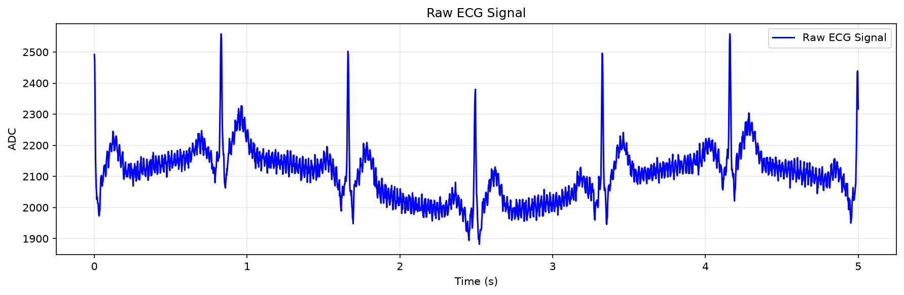
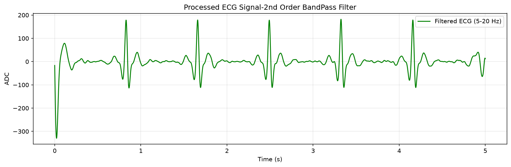
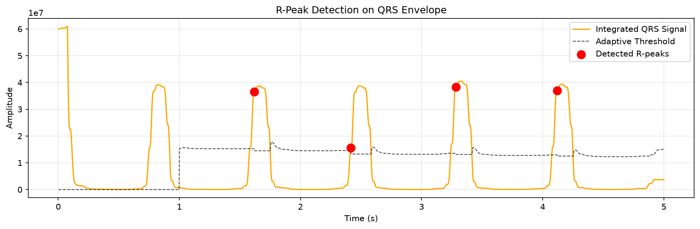

# ECG Signal Processing & Heart Rate Detection

Embedded ECG processing pipeline for real-time R-peak detection, BPM estimation, and signal-quality assessment.

The start and end time were taken as 0.0 and 5.0 for easier visibility of the PQRST pattern which we can observe in the plots. 
The first second(500 samples) of the readings are used for calibration of the threshold and the signal and noise levels. 

> **Disclaimer:** This project was developed solely for technical assessment purposes. It is not intended for clinical use, medical diagnosis, or patient monitoring.


## System Architecture

```text
ADC @ 500 Hz
    ↓
2nd-Order Band-Pass Filter (5–20 Hz)
    ↓
QRS Enhancement + Moving-Window Integration
    ↓
Adaptive Threshold + Peak Separation
    ↓
R-Peak Detection
    ├──→ BPM Calculation
    └──→ Signal Quality
    ↓
UART Output
```
## Signal Processing

- Sampling rate: 500 Hz
- Filter: 2nd-order Butterworth band-pass, 5–20 Hz
- QRS detection: Moving-window integration with adaptive thresholding
- Peak validation: Minimum peak separation

The 5–20 Hz band-pass emphasizes the QRS complexes while reducing baseline wander and high-frequency noise. A 2nd-order filter provides a practical balance between signal conditioning and embedded CPU cost.

## R-Peak & BPM Detection
RR intervals are calculated from consecutive detected R-peaks:
``` text
BPM = 60 / Mean RR Interval
```
## Signal Quality
Signal quality is evaluated using the QRS signal/noise levels and RR variation.
```text
Signal Level : 60937052.41
Noise Level  : 15007.29
SNR          : 4060.50
RR Variation : 0.0073

Status       : GOOD
```
## UART Output
The embedded system outputs the following CSV format:
``` text
filtered_ecg,r_peak,bpm,status
```
Example: 
```
12.536,0,72.0,GOOD
```

## Plots

### Raw ECG


### Filtered ECG



## R-Peak Detection


